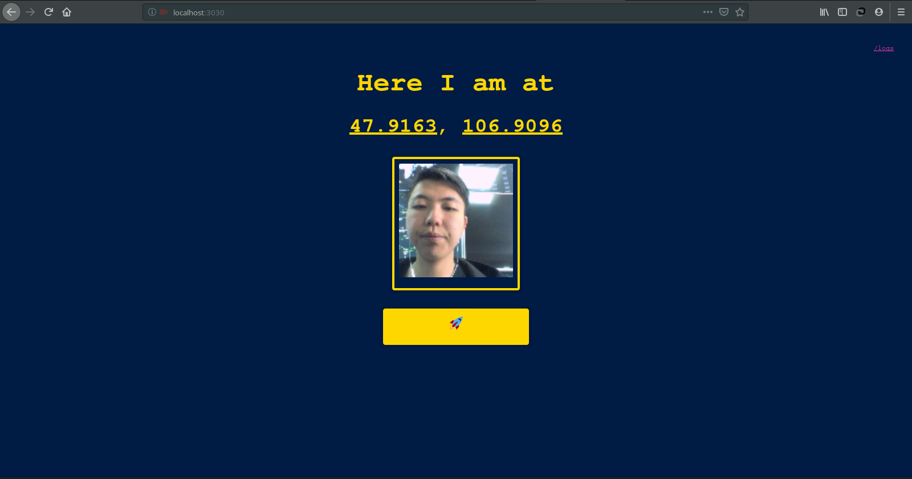
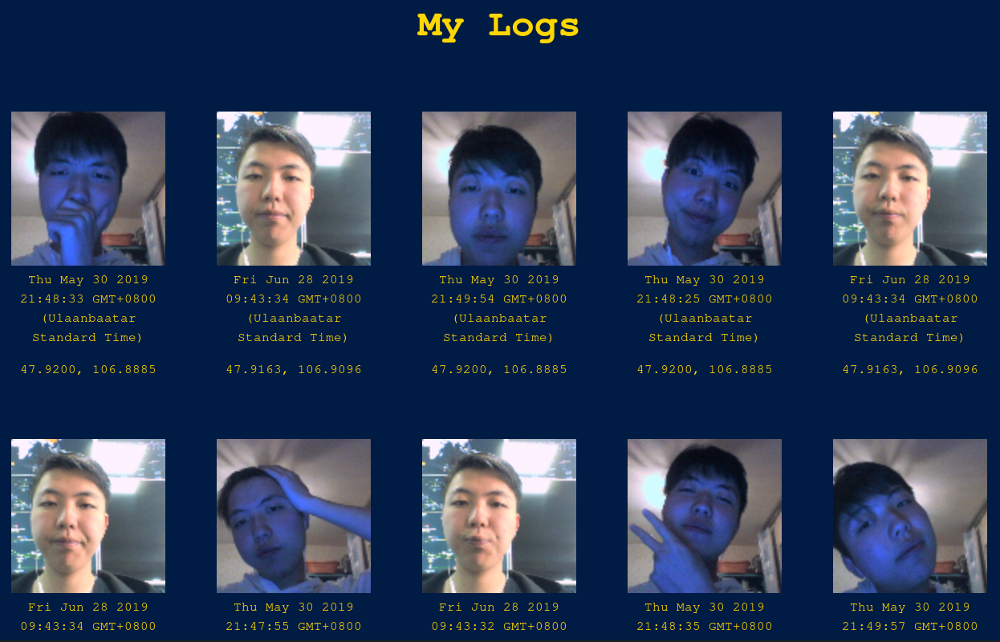
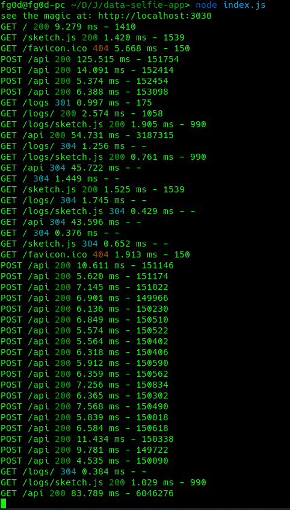

# Data Selfie App 🧐


## Setup 🤔

In your terminal:
```sh
npm install -g node-modules [ node_modules -г үүсгэж байна ]
```

```sh
npm install [ програмд хэрэгтэй сангуудыг татаж суулгана ]
```

then start your server
```sh
npm start [ серверээ асааж байна ]
```
or if in development: `npm run dev`

Go to: `localhost:3030` to see the magic.

## Features (coming soon) 🤓 

- [ ] HTTPS support
- [ ] Authentication and login
- [ ] querying other APIs (e.g. weather)


## Gallery 😍





